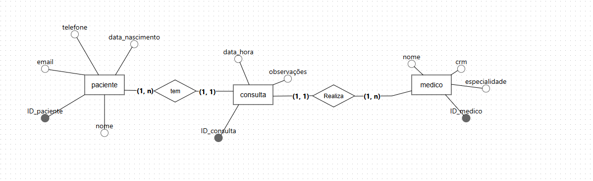
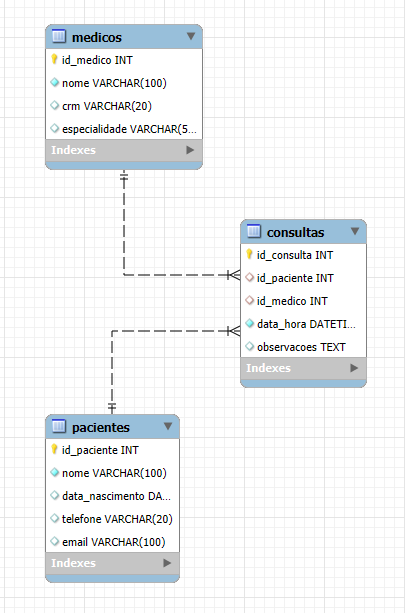
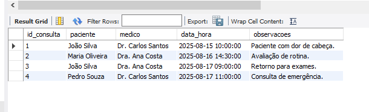
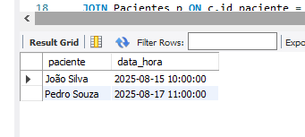
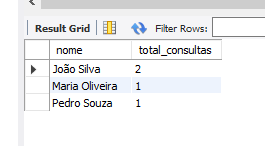

# Projeto de Sistema de Banco de Dados para Clínica Médica

### Descrição do Projeto
#### Banco de dados feito para uma clínica médica. O objetivo é gerenciar informações de pacientes, médicos e consultas, seguindo as regras de modelagem e normalização exigidas. O sistema foi desenvolvido em MySQL (modelo lógico)
  - Para a parte conceitual foi usado o BRmodelo.

---
### Modelagem do Banco de dados
---
### Modelo conceitual.
#### Abaixo está a imagem representando o modelo conceitual utilizado para estruturar o banco de dados do projeto. Ele descreve as entidades, atributos e relacionamentos principais.

### Entidades
- paciente 
- consulta 
- medico 

### Relacionamentos:
 #### REALIZA
- De Medico para realiza: (1,N) - Um médico realiza uma ou mais consultas.
- De Consulta para realiza: (1,1) - Uma consulta é realizada por um único médico.

---
#### TEM
- De Paciente para tem: (1,N) - Um paciente pode ter uma ou mais consultas.
- De Consulta para tem: (1,1) - Uma consulta é agendada para um único paciente.
---
---
### Modelo Lógico e físico 
#### O modelo lógico apresenta a estrutura com base no modelo conceitual

---
### Consultas.
#### Abaixo estará o exemplo de algumas consultas de dados puxados no Mysql

---

#### EXEMPLO 1
- Listar todas as consultas agendadas, mostrando nome do paciente e do médico.

---
#### EXEMPLO 2
 - Encontrar todas as consultas de um médico específico (ex: 'Dr. Carlos Santos')

---

#### EXEMPLO 3 
 - Contar o número total de consultas por paciente.

 

 ---

